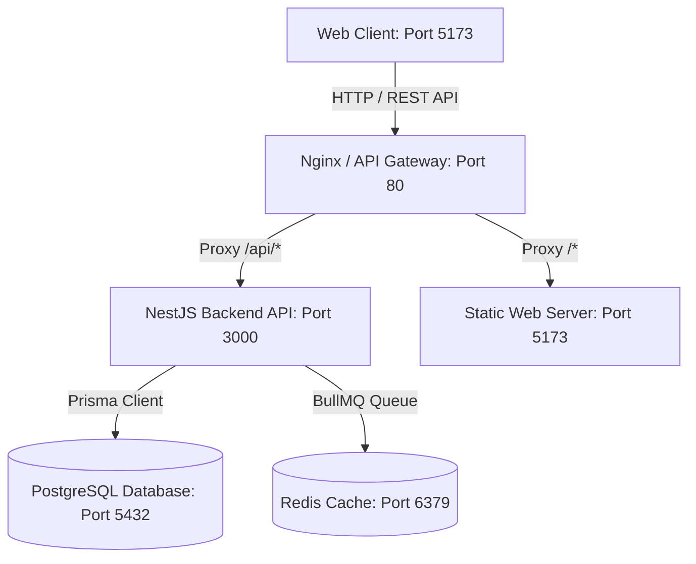

# Halfwave Platforms - Architecture & System Design

## 1. Monorepo Overview

Halfwave Platforms uses a modern, Meta-inspired monorepo architecture managed by `pnpm` workspaces. This structure enables modularity, shared domain contracts, decoupled application lifecycles, and unified DevOps.

```
Halfwave Platforms/
├── apps/                         # Deployable Applications
│   ├── api/                      # Enterprise Backend API (NestJS + Prisma + Redis)
│   └── web/                      # Client Web Platform (SPA / HTML5 / Modular CSS & JS)
├── packages/                     # Shared Internal Libraries
│   ├── config-eslint/            # Centralized lint rules
│   ├── config-typescript/        # Centralized tsconfig presets
│   └── types/                    # Shared TypeScript interfaces & API contracts
├── infrastructure/               # DevOps & Containerization
│   ├── docker/                   # Dockerfiles & docker-compose orchestrations
│   └── nginx/                    # Reverse proxy configurations
├── docs/                         # Architecture, Security, API & Deployment specs
└── scripts/                      # Developer automation and health checkers
```

---

## 2. Component Responsibilities

### `apps/api` (Backend API)
- **Framework**: NestJS 11 (Express platform)
- **Database**: PostgreSQL with Prisma ORM
- **Queue/Cache**: BullMQ & Redis for asynchronous jobs (emails, audit logs)
- **Security**: Helmet, Rate Limiting (Throttler), CORS, RBAC (Role-Based Access Control)
- **Documentation**: Swagger OpenAPI interactive docs available at `/api/v1/docs`

### `apps/web` (Client Web Platform)
- **Stack**: High-performance HTML5, CSS custom properties design tokens, Vanilla JS client engine.
- **Features**: Interactive canvas wave visualizer, expandable ecosystem catalog, theme toggling (dark/light), interactive chat simulation, and API-connected contact submission.

### `packages/types` (Shared Contracts)
- Central source of truth for DTOs, entity definitions, and API response envelopes shared between frontend and backend.

---

## 3. Data Flow


